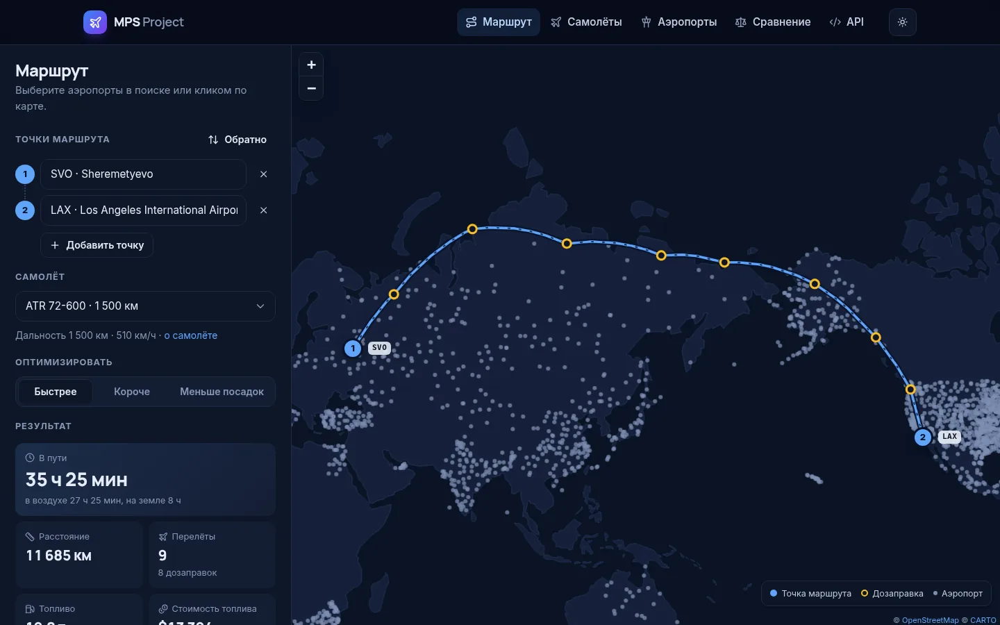
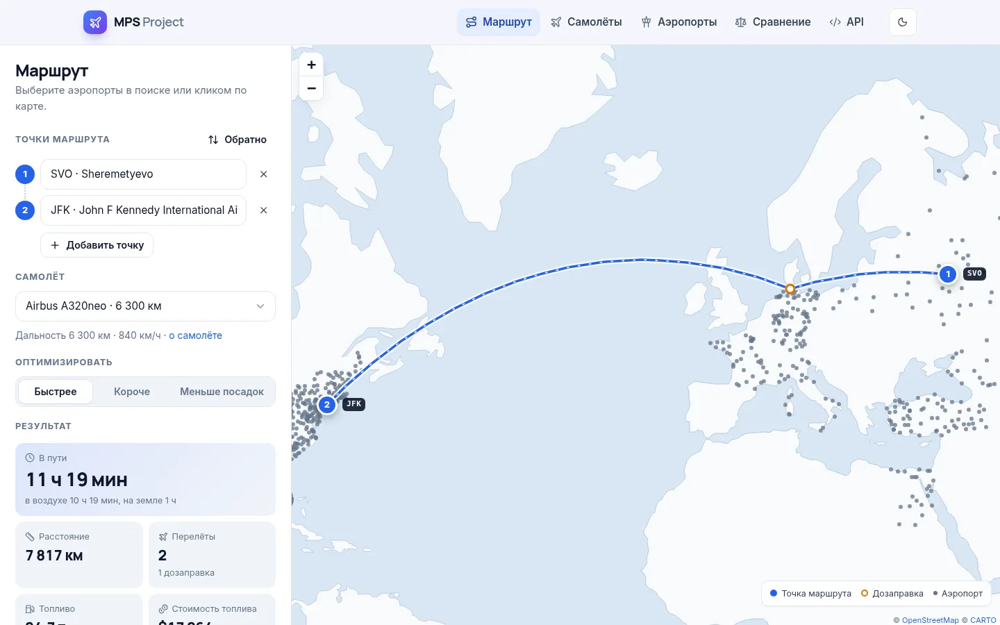
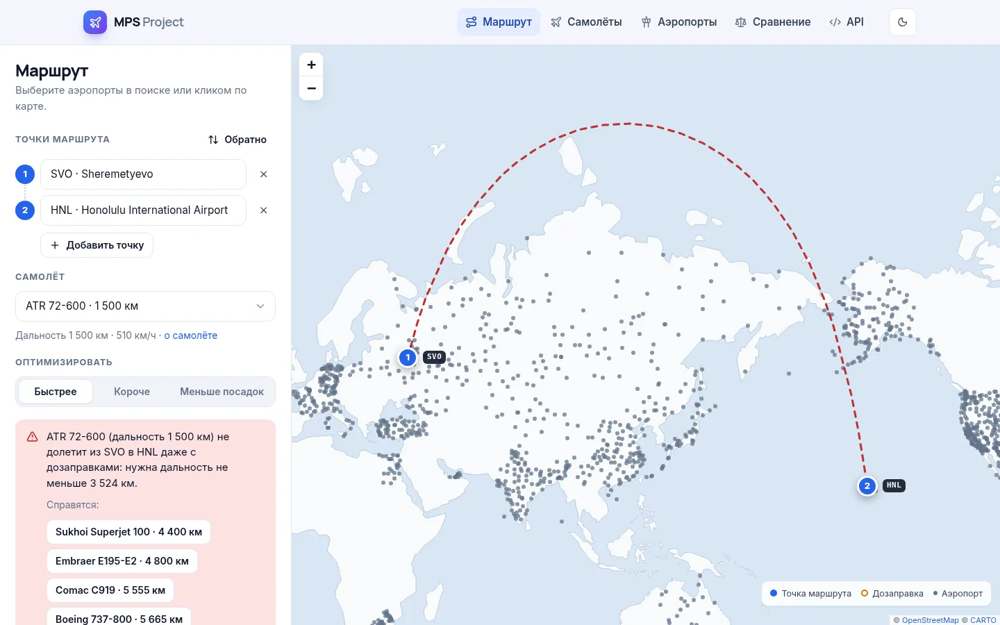
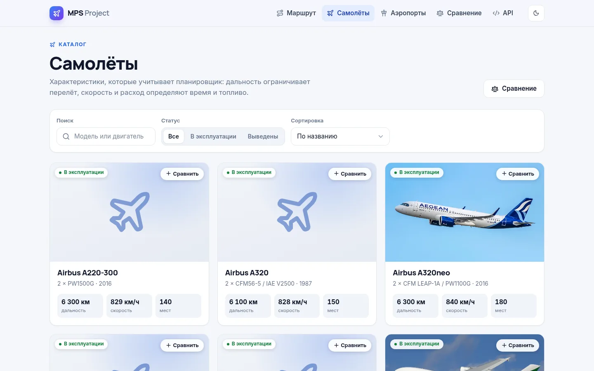
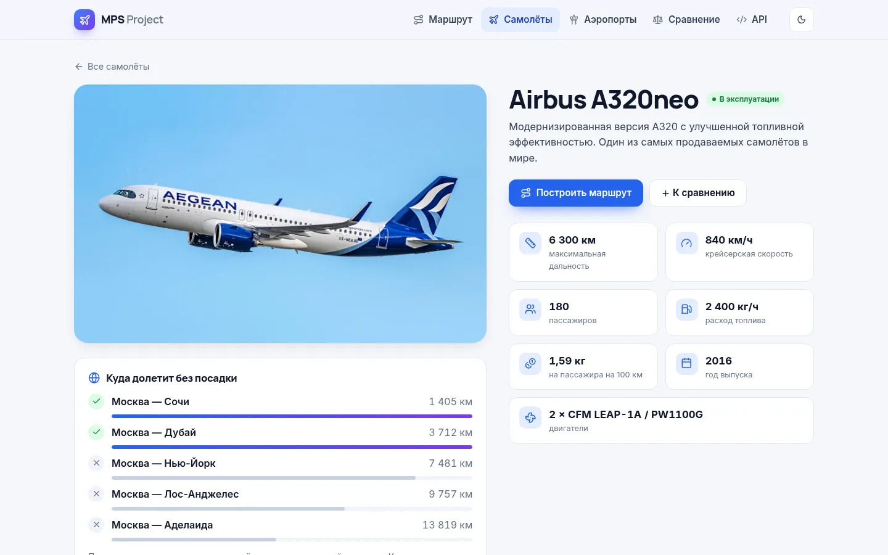
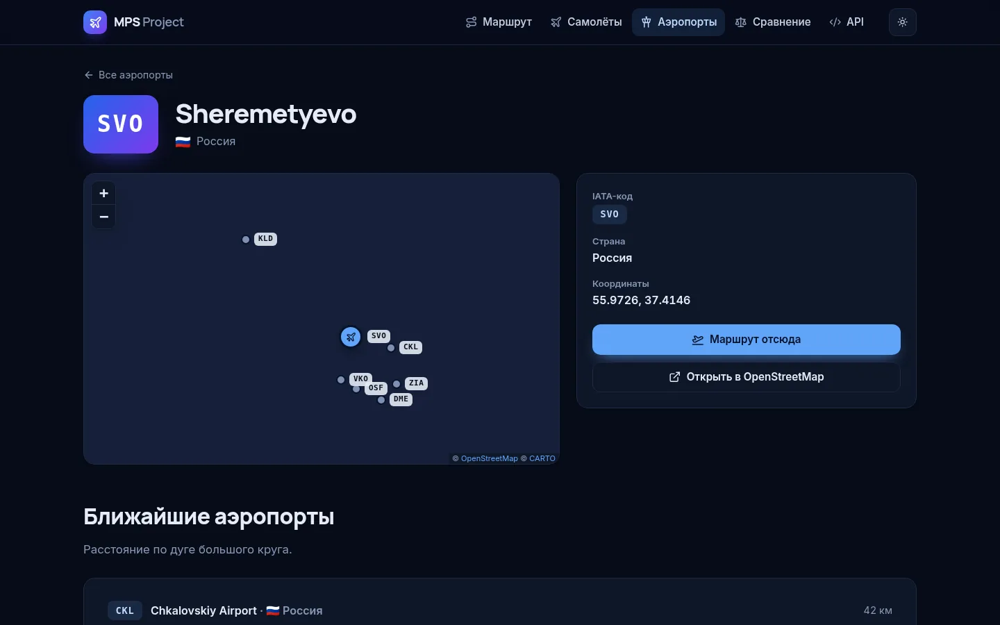
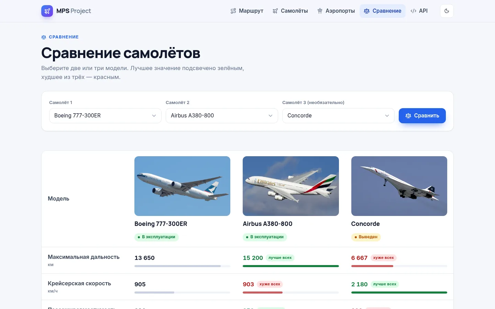

# ✈️ MPS Project

**MPS Project** — веб-приложение для работы с авиационными данными: каталог самолётов и аэропортов, сравнение моделей и планировщик маршрутов, который подбирает промежуточные посадки с учётом дальности конкретного самолёта и считает время в пути, расход и стоимость топлива.



---

## Возможности

### 🗺️ Планировщик маршрутов
- До 8 точек маршрута. Аэропорт можно найти по IATA-коду, названию, стране или городу по-русски («Москва», «Пулково» — работает транслитерация), а можно кликнуть по нему на карте.
- Промежуточные посадки для дозаправки подбираются автоматически. Критерий на выбор: **быстрее** (с учётом взлёта, посадки и стоянки), **короче** или **меньше посадок**.
- Маршрут рисуется по дугам большого круга и корректно пересекает 180-й меридиан.
- Если самолёт не долетает даже с дозаправками, приложение показывает, какой дальности не хватает, и предлагает модели из каталога, которые справятся.
- Время в воздухе и на земле, расход и стоимость топлива по каждому перелёту.
- Состояние хранится в адресной строке: ссылкой на маршрут можно поделиться.
- Если тайлы карты недоступны (нет интернета на защите проекта), подкладываются встроенные контуры материков.





### 📘 Каталог самолётов
- Поиск по модели и двигателям, фильтр «в эксплуатации / выведены», сортировка по дальности, скорости, вместимости, расходу и году.
- Карточка модели: характеристики, расход на пассажира, похожие по дальности модели и блок «Куда долетит без посадки» с контрольными маршрутами.
- Кнопка «Сравнить» на карточках собирает до трёх моделей для сравнения.




### 🌐 Аэропорты
- 2 305 аэропортов из [OpenAIP](https://www.openaip.net): поиск по названию и IATA-коду, фильтр по стране, пагинация.
- Страница аэропорта с картой и списком ближайших аэропортов.



### ⚖️ Сравнение самолётов
Две или три модели бок о бок: лучшее значение подсвечено зелёным, худшее — красным, полосы показывают величину относительно максимума.



Светлая и тёмная темы (по умолчанию — как в системе), адаптивная вёрстка для телефонов.

---

## Как работает построение маршрута

Аэропорты — вершины графа. Перелёт между двумя аэропортами возможен, если расстояние по дуге большого круга (формула гаверсинусов, средний радиус Земли 6371 км) не больше дальности самолёта. Граф полный и неявный: матрицу N×N не строим, соседей вершины считаем векторно в `numpy`, когда вершину раскрывает поиск.

**Поиск — A\*.** Стоимость перелёта длиной `d` — `per_km · d + per_leg`, поэтому один алгоритм решает все три задачи:

| Критерий | per_km | per_leg |
| --- | --- | --- |
| Быстрее | `1 / скорость` | 0,5 ч (взлёт, набор, снижение) + 1 ч (стоянка) |
| Короче | 1 | 10⁻⁶ — при равной длине меньше посадок |
| Меньше посадок | 10⁻⁶ — при равном числе посадок короче | 1 |

Эвристика — `per_km · d(v, цель) + per_leg · ⌈d(v, цель) / дальность⌉`: до цели нельзя пролететь меньше, чем по прямой, и сделать меньше перелётов, чем `⌈d / дальность⌉`. Эвристика допустима и монотонна, поэтому найденный маршрут оптимален. Открытое множество хранится массивом f-оценок: шаг стоит O(N) и выполняется в numpy, в худшем случае O(N²). На реальных данных маршрут строится за 1–80 мс (старая реализация перестраивала граф из 5,3 млн рёбер на каждый сегмент и тратила секунды).

**Если маршрута нет**, решается задача об «узком месте»: та же схема Дейкстры, где вместо суммы берётся максимум. Результат — минимальная дальность, при которой маршрут существует; по ней API подбирает подходящие самолёты.

**Время и топливо.** Время перелёта — `d / скорость + 0,5 ч`, на каждой промежуточной посадке самолёт стоит 1 ч, расход — `кг/ч × время`, цена топлива задаётся в `JET_FUEL_PRICE_USD_PER_KG` (по умолчанию 0,698 $/кг).

Код: [`core/routing.py`](MPS_Project/core/routing.py), [`core/geo.py`](MPS_Project/core/geo.py). Тесты сверяют A\* и «узкое место» с эталонными реализациями (Дейкстра и дерево Прима) на случайных графах.

---

## REST API

| Метод | Адрес | Что возвращает |
| --- | --- | --- |
| GET | `/api/` | список эндпоинтов |
| GET | `/api/airplanes/?search=boeing&in_service=true` | самолёты |
| GET | `/api/airplanes/{id}/` | самолёт |
| GET | `/api/airports/?country=RU&search=pulkovo` | аэропорты; с `?limit=50&offset=100` — постранично |
| GET | `/api/airports/{iata}/` | аэропорт по IATA-коду (регистр не важен) |
| GET | `/api/route/?airports=SVO,JFK&airplane=4&criterion=time` | маршрут |

Параметры маршрута: `airports` — от 2 до 8 IATA-кодов через запятую, `airplane` — id самолёта (без него строятся прямые перелёты), `criterion` — `time`, `distance` или `stops`.

```bash
curl "https://mpsproject.ru/api/route/?airports=SVO,JFK&airplane=4"
```

```jsonc
{
  "criterion": "time",
  "airplane": { "id": 4, "name": "Airbus A320neo", "range_km": 6300, "cruise_speed_kmh": 840, "fuel_burn_kg_h": 2400, "in_service": true },
  "stops": [
    { "iata_code": "SVO", "name": "Sheremetyevo", "country": "RU", "country_name": "Россия", "latitude": 55.9726, "longitude": 37.4146, "is_waypoint": true },
    { "iata_code": "QHU", "name": "Husum-Schwesing", "country": "DE", "country_name": "Германия", "latitude": 54.51, "longitude": 9.1383, "is_waypoint": false },
    { "iata_code": "JFK", "...": "..." }
  ],
  "legs": [
    { "origin": "SVO", "destination": "QHU", "distance_km": 1787.3, "flight_time_h": 2.63, "fuel_kg": 6307.0, "path": [[55.9726, 37.4146], [56.0653, 35.8255], "..."] },
    { "origin": "QHU", "destination": "JFK", "distance_km": 6029.4, "flight_time_h": 7.68, "fuel_kg": 18427.0, "path": ["..."] }
  ],
  "summary": {
    "distance_km": 7816.7, "flights": 2, "technical_stops": 1, "max_leg_km": 6029.4,
    "flight_time_h": 10.31, "ground_time_h": 1.0, "total_time_h": 11.31, "fuel_kg": 24733.0, "fuel_cost_usd": 17264.0
  }
}
```

Ошибки: `400` — некорректные параметры (неизвестный или повторяющийся код, нет такого самолёта), `422` — самолёт не долетает даже с дозаправками (в ответе `required_range_km`, `gaps` и `suitable_airplanes`), `429` — превышен лимит запросов (по умолчанию 60 в минуту, `ROUTE_THROTTLE_RATE`).

---

## Запуск локально

Нужен Python 3.12+ (проверено на 3.13). Без настроек PostgreSQL используется SQLite.

**Windows (PowerShell):**
```powershell
cd MPS_Project
python -m venv .venv
.venv\Scripts\Activate.ps1
pip install -r requirements-dev.txt
copy .env.example .env
python manage.py migrate
python manage.py loaddata airplanes airports
python manage.py runserver
```

**Linux / macOS:**
```bash
cd MPS_Project
python3 -m venv .venv && source .venv/bin/activate
pip install -r requirements-dev.txt
cp .env.example .env
python manage.py migrate
python manage.py loaddata airplanes airports
python manage.py runserver
```

Сайт — http://127.0.0.1:8000, админка — `/admin/` (пользователь создаётся командой `python manage.py createsuperuser`).

Все настройки читаются из переменных окружения или файла `.env` — см. [`.env.example`](MPS_Project/.env.example).

### Импорт аэропортов из OpenAIP

Нужен бесплатный ключ OpenAIP в `OPENAIP_API_KEY`:

```bash
python manage.py import_airports RU KZ DE --dry-run   # проверить, ничего не сохраняя
python manage.py import_airports RU KZ DE
```

Берутся аэропорты с IATA-кодом; существующие обновляются по коду, описание не затирается. Названия из OpenAIP (ВСЕ ЗАГЛАВНЫЕ, обрезаны до 40 символов) приводятся к нормальному виду: `DOMODEDOVO INTERNATIONAL AIRPORT` → `Domodedovo International Airport`, `CASPER-NATRONA COUNTY INTERNATIONAL AIRP` → `…International Airport`.

### Тесты и линтер

```bash
python manage.py test
ruff check . && ruff format --check .
```

66 тестов: геометрия, нормализация названий, алгоритм (включая сверку с эталоном на случайных графах), миграция старой базы, импорт, API и страницы.

---

## Продакшен (Docker)

```bash
cd MPS_Project
cp .env.example .env    # DJANGO_DEBUG=False, DJANGO_SECRET_KEY, DJANGO_ALLOWED_HOSTS, POSTGRES_*
docker compose up -d --build
docker compose exec django python manage.py loaddata airplanes airports   # только для пустой базы
```

Контейнер при старте применяет миграции и собирает статику (с хэшами в именах файлов), дальше работает gunicorn за nginx. В составе — PostgreSQL 16, Redis для кэша и троттлинга, certbot с автопродлением сертификата.

Первый сертификат выпускается вручную, пока nginx отдаёт `/.well-known/acme-challenge/`:

```bash
docker compose run --rm --entrypoint certbot certbot certonly --webroot -w /var/www/certbot -d mpsproject.ru
```

**Обновление существующей базы.** `migrate` переносит данные автоматически: названия аэропортов приводятся к нормальному регистру, заглушки «No description» очищаются, поле «мощность двигателя» заменяется описанием двигателей, исправляются ошибочные данные Cessna 172.

---

## Структура проекта

```
MPS_Project/
├── MPS_Project/          настройки, корневые URL, WSGI/ASGI
├── core/                 предметная область
│   ├── models.py         Airplane, Airport
│   ├── geo.py            гаверсинус, точки дуги большого круга
│   ├── routing.py        индекс аэропортов, A*, «узкое место», план маршрута
│   ├── names.py          нормализация названий из OpenAIP
│   ├── openaip.py        клиент OpenAIP и импорт
│   ├── management/       команда import_airports
│   ├── fixtures/         демо-данные: 25 самолётов, 2 305 аэропортов
│   └── tests/
├── api/                  REST API на Django REST Framework
├── web/                  страницы сайта
│   ├── views.py, comparison.py, templatetags/ui.py
│   ├── templates/        base.html и страницы
│   └── static/           CSS-дизайн-система, ES-модули, шрифты, иконки, Leaflet
├── media/seed/           фото самолётов для демо-данных
├── Dockerfile, docker-compose.yml, nginx.conf
└── requirements.txt, requirements-dev.txt, pyproject.toml
```

---

## Что изменилось в версии 2.0

**Исправленные ошибки**
- Построение маршрута не работало на сервере: POST-запрос требовал CSRF-cookie, которую страница карты не выставляла, а nginx не передавал `X-Forwarded-Proto`. Теперь это GET-запрос к API.
- Команда импорта лежала в папке `managment` (опечатка), поэтому Django её не видел, и она всё равно ничего не сохраняла.
- В Docker Django подключался к `localhost` вместо контейнера `db`, в зависимостях не было gunicorn, `DEBUG` и хосты игнорировали переменные окружения.
- Нельзя было построить маршрут «туда и обратно»: повторяющиеся аэропорты удалялись.
- Если самолёт не долетал, его дальность молча увеличивалась вдвое — строился маршрут, который он пролететь не может.
- Сортировка и поиск в каталоге сбрасывали друг друга; ссылки пагинации ломались на поиске с `&`; загрузка фото больше 1 МБ отклонялась nginx.
- У Cessna 172 значились 20 мест и 90 000 л. с.; «мощность» других самолётов на деле была тягой в фунтах.

**Безопасность**
- Из репозитория удалён дамп базы с хэшем пароля администратора и сессиями; секретный ключ больше не имеет значения по умолчанию в продакшене.
- PostgreSQL не публикуется наружу, в админке нет `mark_safe`, API не отдаёт тексты внутренних исключений.

**Алгоритм** — A\* вместо полного перебора, три критерия оптимизации, реалистичная модель времени, диагностика недостижимых маршрутов, кэш индекса аэропортов с инвалидацией при изменении таблицы.

**Интерфейс** — общий шаблон и дизайн-система вместо ~5 000 строк CSS и JS, скопированных в каждую страницу; без Tailwind Play CDN и бета-версии Font Awesome; тема без мигания при загрузке; автодополнение аэропортов; карта с точками всех аэропортов; фото пережаты с 13,6 МБ до 0,4 МБ.

---

Проект подготовили студенты группы ИКБО-42-23:
- **Хомяков В. Н.** — тимлид, архитектор и разработчик backend
- **Власов И. Д.** — backend-разработчик, тестировщик
- **Лазурин Е. Е.** — frontend-разработчик
